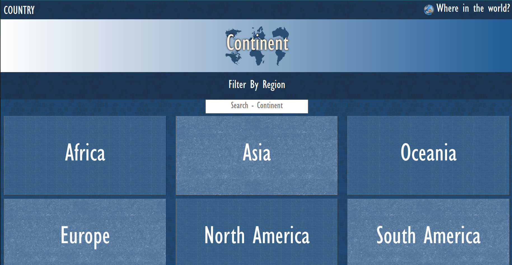
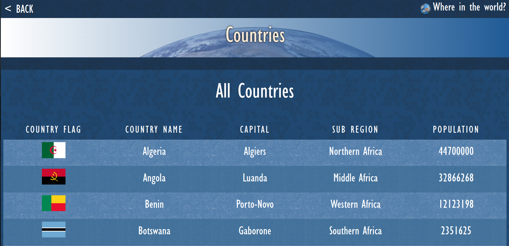
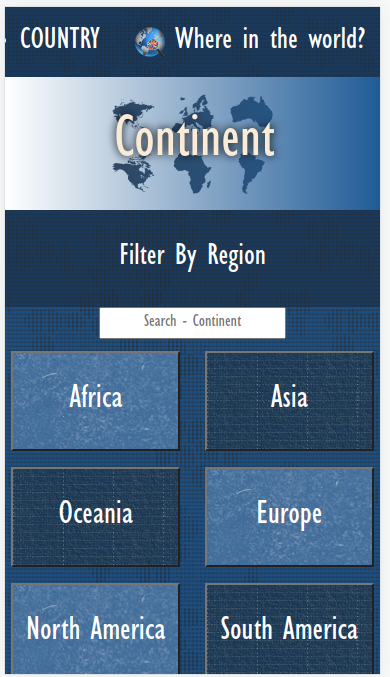
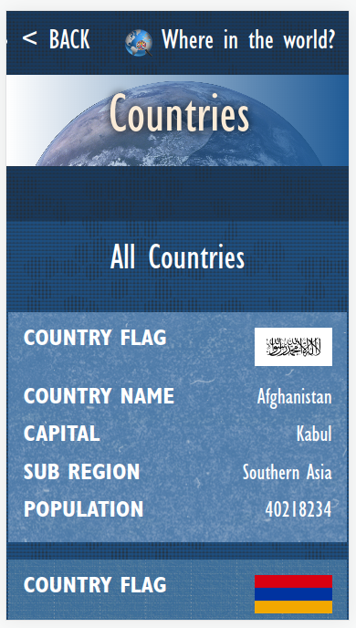

# Rest Countries Api

> Rest Country api is a react redux application based data fetched from rest countries api. The application allows user to filter information by different continents.

## Built With

- HTML
- CSS
- JavaScript
- React
- Redux

## Live Demo

[Live Demo Link](https://631b59aa07415c168cf6fcc0--polite-griffin-2be7d6.netlify.app/)

## Quick view

## Getting Started
- Make sure you have node installed on your local machine.

step 1: Clone this repo locally using git in the command line and the following command

git clone https://github.com/aron-helu/Rest-Countries.git

Step 2: run npm install to download the necessary modules.

step 3: run npm start to load the project.

### Prerequisites

Any html and css code editor like Vscode or Vim.

## Authors

👤 **Aaron Abraham**

- GitHub: [@Aaron](https://github.com/aron-helu)

- LinkedIn: [@Aaron](https://www.linkedin.com/in/aron-abraham-90a4321b0/)

## 🤝 Contributing

Contributions, issues, and feature requests are welcome!

Feel free to check the [issues page](../../issues/).

## Show your support

Give a ⭐️ if you like this project!

## Acknowledgments

- Hat tip to anyone whose code was used
- Inspiration
- etc

## 📝 License

This project is [MIT](./MIT.md) licensed.